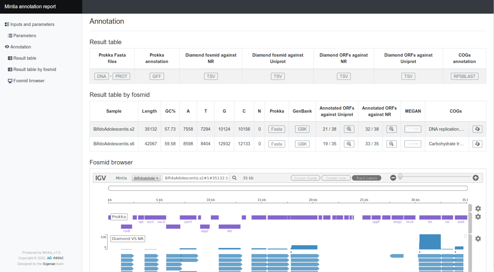

# MINTIA - Metagenomic INsertT BIoinformatic Annotation

## Description
> Functional metagenomics is used to understand who is doing what in microbial ecosystems. DNA sequencing can be prioritized by activity-based screening of libraries obtained by cloning and expressing metagenomic DNA fragments in an heterologous host. When large insert libraries are used, allowing a direct access to the functions encoded by entire metagenomic loci sizing several dozens of kbp, NGS is required to identify the genes that are responsible for the screened function. MINTIA is an easy to use pipeline assembling and annotating metagenomic inserts.

> The assembly module (assemble) assembles, cleans and extracts the longest and most covered contigs for each DNA insert. It handles reads (454, ion torrent,...) or read pairs (Illumina,...). This tools is not able to process PacBio or Oxford Nanopore reads. It sub-selects by default 300X read coverage depending on the sequencing platform and assembles them, removes cloning vector and selects best contigs. Only contigs with length and average depth over given thresholds are kept. The produced HTML report includes a dynamic graphic with contig length and coverage for each sample.

> The annotation module (annotate) aims at obtaining main gene functions and a functional classification. The pipeline launches at least prokka for ORF detection, generating fasta files for genes and proteins as well as a tabular file containing ORFs description. Depending on additional options selected, contigs and ORFs are aligned against NCBI NR (Non Redundant) as well as SP (SwissProt) and COGss databases. The produced HTML report includes all results and allow to explore annotations based on [igv.js](https://github.com/igvteam/igv.js) an embeddable interactive genome visualization component.


## Table of content
- [Installation](#installation)
	- [Install](#install)
	- [Tools dependencies](#tools-dependencies)
	- [Databanks](#databanks)
- [Run MINTIA](#run-mintia)
	- [Check tools dependencies](#check-tools-dependencies)
	- [Assemble](#assemble)
	- [Annotate](#annotate)
- [License](#license)
- [Copyright](#copyright)
- [Contact](#contact)

## Installation
This MINITA repository is for command line user.

#### Install
Clone this repository:
```sh
$ git clone --recursive https://github.com/Bios4Biol/MINTIA.git
```
Use conda to install the third party software:
```sh
$ cd MINTIA
$ conda env create --file environment.yaml
$ unset PERL5LIB
$ conda activate mintia
```
Two dependencies will not be installed by conda and must be installed "manually":
- cross_match **required** for the assemble module (step1): [cross_match](http://www.phrap.org/consed/consed.html#howToGet)
- MEGAN5 (optional) for the annotate module (step2): [megan5](https://software-ab.informatik.uni-tuebingen.de/download/megan5/welcome.html)

Tools dependencies can be checked:
```sh
$ ./mintia.pl check
##############################################
        Mintia_v1.0 check dependencies
##############################################

- Step 1 - assemble:
  => spades...........ok...version:v3.13.1
  => cross_match......ok...version:1.090518

- Step 2 - annotate:
  => prokka...........ok...version:1.14.5
  => diamond..........ok...version:0.9.29
  => xvfb-run.........ok
  => MEGAN............ok...version:5.11.3
  => rpsblast.........ok...version:2.9.0
  => samtools.........ok...version:1.9
  => tabix............ok...version:1.9
```
#### Tools dependencies
| Tools | Tested version || Tools | Tested version |
| ------------- | ------------- | ------------- | ------------- | ------------- |
| **`cross_match`** | `1.090518` || **`bgzip`** | |
| **`spades`** | `v3.13.0` || **`file`** | `file-5.04` |
| **`prokka`** | `1.13.3` || **`grep`** | `GNU grep 2.6.3` |
| **`diamond`** | `0.8.24` || **`which`** |  |
| **`megan`** | `5.10.6` || **`xvfb-run`** | |
| **`samtools`** | `1.3.1` || **`tabix`** | `0.2.5 (r964)` |
| **`rpsblast`** | `2.9.0` || | |

#### Databanks
Reference databases are required for the "annotate" module.
- NR: non-redundant protein database indexed for Diamond (used by -F and -M [see below](#annotate)) 
- Uniprot/Swissprot: protein database indexed for Diamond (used by -F [see below](#annotate))
- COGs: database of Clusters of Orthologous Groups of proteins, input of `rpsblast` (used by -C [see below](#annotate))
> Create COGs DB
```sh
$ wget ftp://ftp.ncbi.nih.gov/pub/mmdb/cdd//cdd.tar.gz
$ tar -xvzf cdd.tar.gz
$ makeprofiledb -title COG.3-28-17 -in Cog.pn -out Cog.v3-28-17 -threshold 9.82 -scale 100.0 -dbtype rps -index true
```

## Run MINTIA

#### Check tools dependencies

```
$ ./mintia.pl check -h
Name:
     mintia.pl - Fosmid assembly and annotation pipeline.

Check Synopsis:
     mintia.pl check

Check Options:
    -h, --help
             Print help
```

#### Assemble

```
$ ./mintia.pl assemble -h
Name:
     mintia.pl - Fosmid assembly and annotation pipeline.

Assemble Synopsis:
     mintia.pl assemble -i FASTQ_FILE[S] -v FASTA_FILE -d STR

Assemble Options:
    -i, --input FILE[S]
             Fastq(.gz) file(s)
             For each sample one OR two fastq file must be provided:
             - Paired data must contain R1/R2: R[12].f[ast]q[.gz]
               Ex: sampleName1_R1.fastq sampleName1_R2.fastq
                   sampleName2_R1.fq.gz sampleName2_R2.fq.gz
             - Single data
               Ex: sampleName.f[ast]q[.gz]

    -v, --vectorSeq FILE
             Vector fasta file

    --length INT
             Fosmid's expected length [40000]

    --minimalContigLength INT
             Contig's minimum length [1000]

    --minimalContigDepth INT
             Contig's minimum depth [8]

    -c, --maxDepth INT
             Coverage, maximum depth use to filter input reads [300]

    -d, --dirOutputs STR
             Path to the outputs directory

    -H, --htmlOutput STR
             HTML output name [mintia_assemble.html]

    -L, --logOutput STR
             Log output file name [mintia_assemble.log]

    -t, --threads
             number of threads for SPADES [8]

    -h, --help
             Print help
```
Example based on test data:
```
./mintia.pl assemble -t 1 -i Data/Input/Assemble/BifidoAdolescentis.s*gz -v Data/Input/Assemble/pCC1FOS.fasta -len 40000 -c 300 -d Data/Output/Assemble/
```
<p align="center">
	<a href="http://genoweb.toulouse.inra.fr/~sigenae/MINTIA/Assemble/mintia_assemble.html" target="_blank"></a>
</p>

#### Annotate

```
$ ./mintia.pl annotate -h
Name:
     mintia.pl - Fosmid assembly and annotation pipeline.

Annotate Synopsis:
     mintia.pl annotate -i FASTA_FILE -n NR_DMND_FILE -u UNIPROT_DMND_FILE -F -d STR

Annotate Options:
    -i, --input FILE
             Fasta(.gz) file

    -s, --separator CHAR [#]
             Which separator allows retreiving the fosmid name
             This separator will be also use to create ORF id
             Example: >fosmidName1#contig1... |
                      >fosmidName1#contig2... | => fosmidName1
                      >fosmidName1#contig3... |

    -n, --nrDB FILE
             Non-redundant proteins database indexed for Diamond (Ex: the nr.dmnd)
             Required by -F.

    -u, --uniprotDB FILE
             Proteic sequence database indexed for Diamond (Ex: the uniprot_sprot.dmnd)
             Required by -F and -M.

    -F, --FunctionalAndTaxonomic
             Run functional and taxonomic annotations
             -n, --nrDB and -u, --uniprotDB must be provided

    -e, --evalue FLOAT
             Maximum diamond e-value to report alignments [10e-8]

    -q, --queryCover INT
             Minimum diamond query cover% to report an alignment [50]

    -M, --Megan FILE
             Run MEGAN - A license file must be provided
             -n, --nrDB must be provided

    -C, --Cog FILE
             Run annotations with COGs, DB COGs path file

    -c, --cMaxEvalue FLOAT
             Max Evalue for Rps-Blast COGs filtering [10e-8]

    -S, --SubmissionFiles
             Build submission files

    -D, --DiamondAgainstPrivateDB FILE
             Run diamond against your own protein reference FASTA file

    -t, --threads INT
             Number of threads for Blast [8]

    -d, --dirOutputs STR
             Path to the outputs directory

    -H, --htmlOutput STR
             HTML output name [mintia_annotate.html]

    -L, --logOutput STR
             Log output file name [mintia_annotate.log]

    -k, --keepTmpFiles
             Keep temporary files

    -h, --help
             Print help
```
Example based on test data:
```
# Without Megan and COG annotations
./mintia.pl annotate -F -i Data/Output/Assemble/mintia_assemble.fasta -d  Data/Output/Annotate2/ -t 1 -S -n Data/Input/Annotate/NR_subset4test.dmnd -u Data/Input/Annotate/UNIPROT-SP_subset4test.dmnd

# With Megan and COG annotations
./mintia.pl annotate -F -C PATH_TO_COG_DB/Cog.v3-28-17 -M PATH_TO_YOUR_LICENSE/MEGAN5-academic-license.txt - Data/Output/Assemble/mintia_assemble.fasta -d  Data/Output/Annotate2/ -t 1 -S -n Data/Input/Annotate/NR_subset4test.dmnd -u Data/Input/Annotate/UNIPROT-SP_subset4test.dmnd
```
<p align="center">
	<a href="http://genoweb.toulouse.inra.fr/~sigenae/MINTIA/Annotate/mintia_annotate.html" target="_blank"></a>
</p>

## License
GNU GPL v3

## Copyright
2020 INRAE

## Contact
support.sigenae@inra.fr
